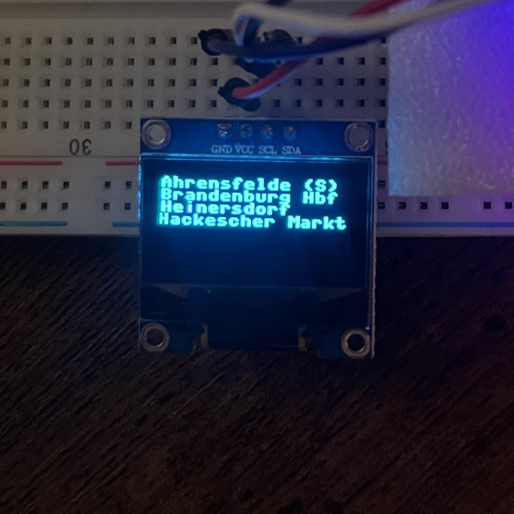
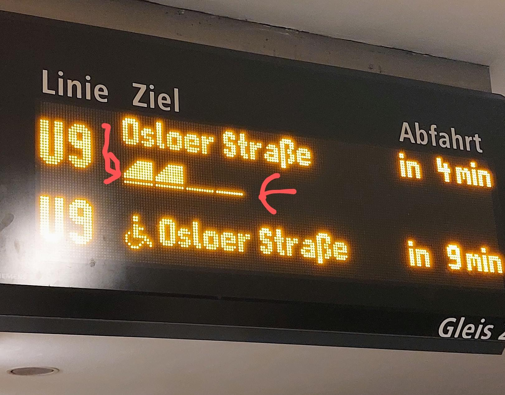

# OLED U-Bahn Sign

# Description

The Intention of this project is to create a tiny, living U-Bahn Sign that displays arrivals/departures at a given station

# Current Appearence

Ultimately, I am going for something that looks like this sign that you'd see in a U-Bahn station:

The source of this image is from [this post](https://i.redd.it/gpu45ktwzy181.jpg)

# TODO

- Add time-to-arrival information
- Add line information 
- Add special symbols (handicap information, etc.)

# References

[Deutsch Bahn Transport Rest API Documentation](https://v6.db.transport.rest/)

[SSD1306 OLED I2C Interface Library](https://how2electronics.com/micropython-interfacing-oled-display-esp32/)

